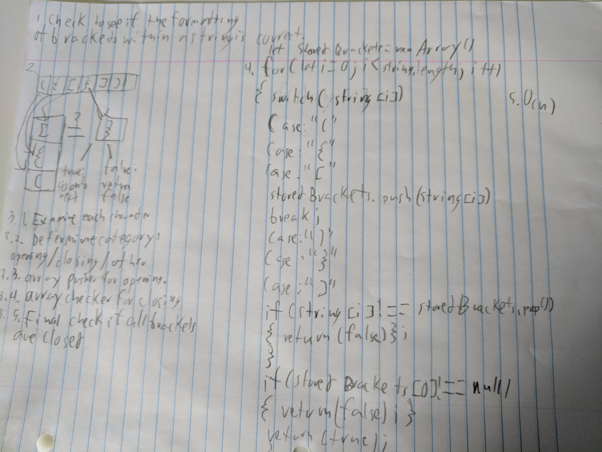

# FizzBuzz Tree
This takes in a tree, replaces the numbers within which are divisible by 3, 5 and 15 with 'fizz', 'buzz' and 'fizzbuzz' respectively.

## Challenge
Create a program which modifies a tree, replacing each instance of a number divisible by 3 with 'fizz', 5 with 'buzz', and 15 with 'fizzbuzz'.

## Solution

